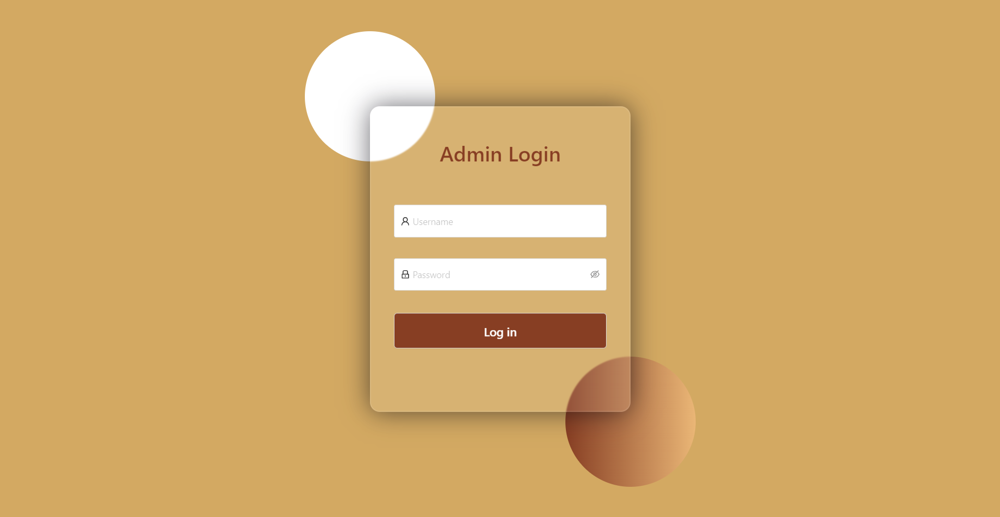
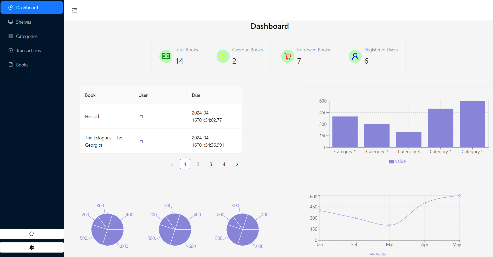
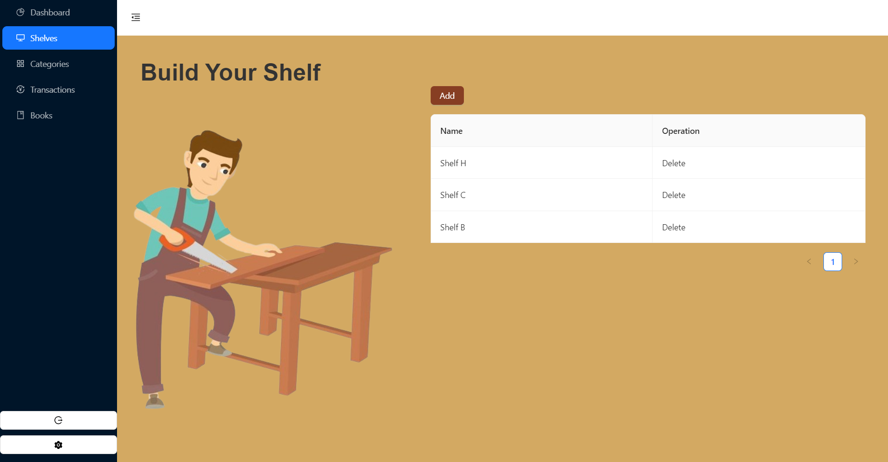
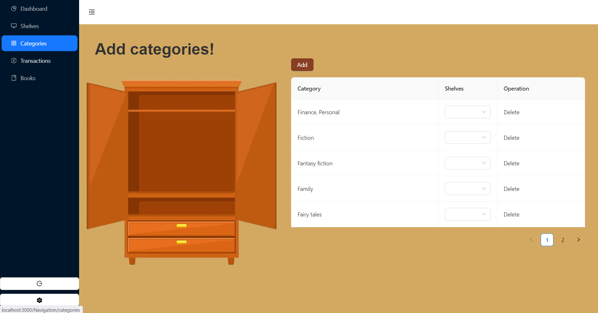
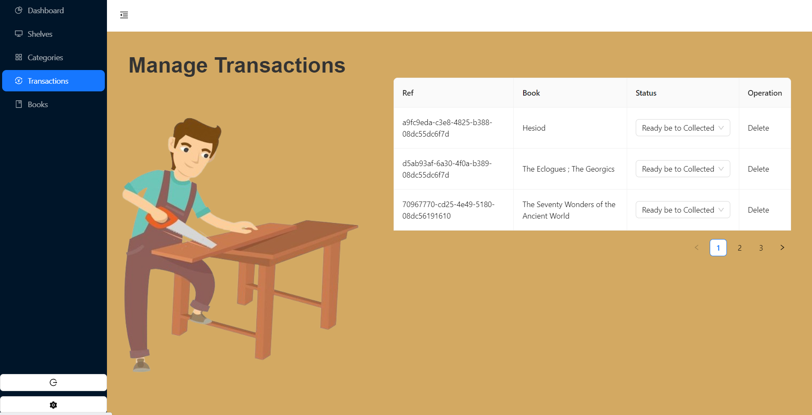
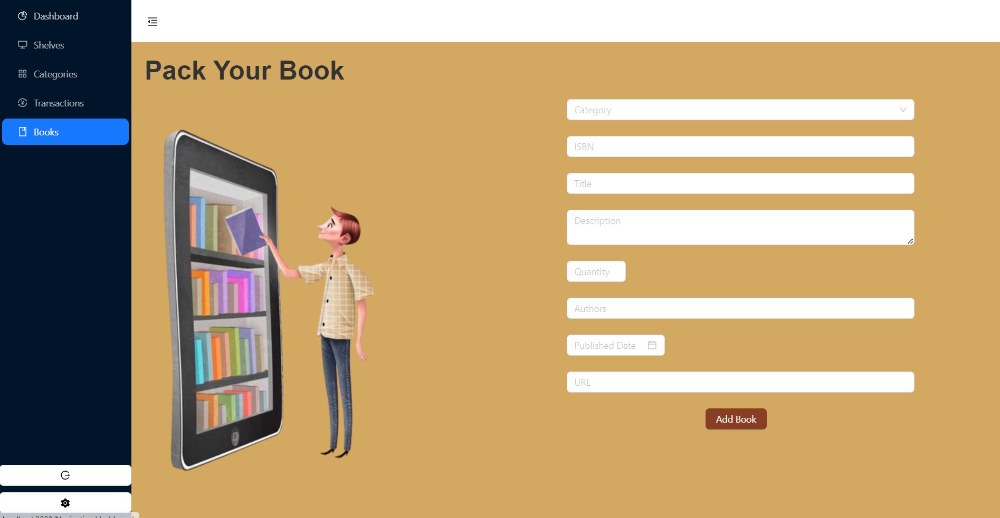
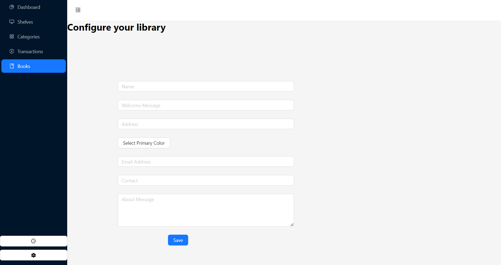

# <em>LibraryBox</em> Admin 

## What does the app do?

This is the admin system used by librarians to manage shelves,categories,books and lastly change how the client app looks by configuring the client side.

This project was bootstrapped with: npx create-next-app@latest

## Available Scripts

In The Project directory, you can run:

### `npm run dev`

Runs the app in the development mode.\
Open [http://localhost:3000](http://localhost:3000) to view it in your browser.

---

## Admin App Screenshots

  
<em>Admin Login</em>

  
<em>Dashboard</em>

  
<em>Manage Shelves</em>

  
<em>Manage Categories</em>

  
<em>Manage Transactions</em>

  
<em>Manage Books</em>

  
<em>Configuration page</em>

